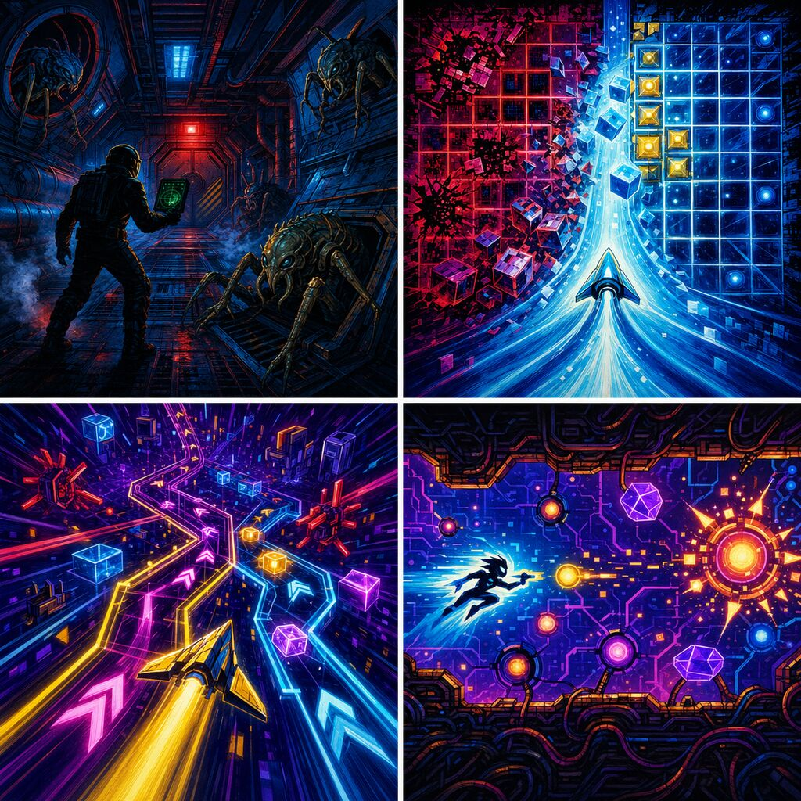

# Arcade Cover Document 13–16

| # | Game | Individual cover |
|---:|---|---|
| 13 | SHIFT 33: Skeleton Watch | [13-shift-33.jpg](./cards/13-shift-33.jpg) |
| 14 | Signal Sweeper | [14-signal-sweeper.jpg](./cards/14-signal-sweeper.jpg) |
| 15 | Relay Rush | [15-relay-rush.jpg](./cards/15-relay-rush.jpg) |
| 16 | Node Blaster | [16-node-blaster.jpg](./cards/16-node-blaster.jpg) |
